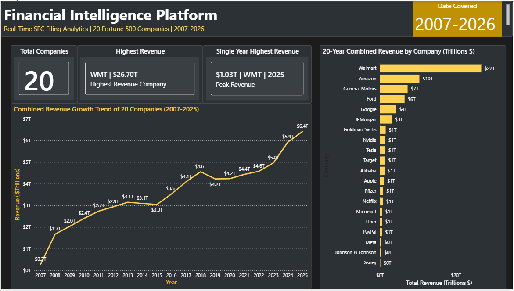
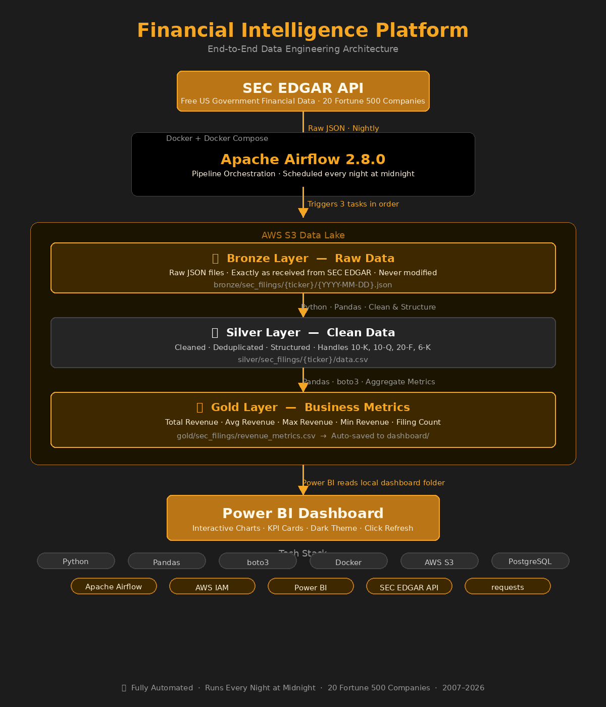

# Financial Intelligence Platform

> An automated end-to-end data engineering pipeline that collects, transforms and visualizes financial data for 20 Fortune 500 companies using Apache Airflow, AWS S3, Python, Pandas, boto3, Docker and Power BI.

---

## Dashboard



---

## Architecture



---

## How It Works

Every night at midnight Apache Airflow automatically runs 3 tasks in order:

**Task 1 — Download** → Pulls raw JSON data from SEC EDGAR API for 20 companies → Saves to AWS S3 Bronze layer

**Task 2 — Clean** → Reads Bronze data → Cleans and structures it → Saves to AWS S3 Silver layer

**Task 3 — Aggregate** → Reads Silver data → Calculates business metrics → Saves to AWS S3 Gold layer → Auto-saves to Power BI dashboard folder

Power BI reads the Gold layer and shows interactive charts. Click Refresh for latest data.

---

## Medallion Architecture

| Layer | Description | Format |
|-------|-------------|--------|
| 🥉 Bronze | Raw data exactly as received from SEC | JSON |
| 🥈 Silver | Cleaned, structured, deduplicated data | CSV |
| 🥇 Gold | Aggregated business metrics ready for dashboard | CSV |

---

## Tech Stack

| Tool | Purpose |
|------|---------|
| Apache Airflow 2.8.0 | Pipeline orchestration and scheduling |
| AWS S3 | Cloud data lake storage |
| Python + Pandas | Data transformation and aggregation |
| boto3 | AWS S3 read and write operations |
| Docker + Docker Compose | Running Airflow locally in containers |
| Power BI | Interactive dashboard and visualization |
| PostgreSQL | Airflow metadata database |
| AWS IAM | Secure access control with least privilege |
| SEC EDGAR API | Free US government financial data source |

---

## Companies Tracked

Apple · Microsoft · Google · Amazon · Tesla · META · NVIDIA · JP Morgan · Walmart · Jhonson & Johnson · Goldman Sachs · Ford · General Motors · Pfizer · Target · NEFLIX · Alibaba · Disney · UBER · PayPal

---

## How to Run

**1. Clone the repo**
```bash
git clone https://github.com/karuprak/financial-intel-platform.git
cd financial-intel-platform
```

**2. Set up Python environment**
```bash
python -m venv venv
venv\Scripts\activate
pip install -r requirements.txt
```

**3. Add your AWS credentials**
```bash
cp .env.example .env
```
Fill in your AWS keys in the `.env` file.

**4. Create S3 bucket with 3 folders**
your-bucket/bronze/
your-bucket/silver/
your-bucket/gold/

**5. Start Docker**
```bash
docker compose up -d
```

**6. Open Airflow**
Enable `sec_filing_pipeline` and click ▶ to run.
URL:      http://localhost:8080
Username: admin
Password: admin

**7. Open Power BI**

Open `dashboard/financial_dashboard.pbix` → Click Refresh → Data

---

## Dashboard Features

- **20 companies tracked** across tech, finance, retail, healthcare and automotive
- **19 years of data** from 2007 to 2026
- **WMT dominates** with $26.70T combined 20-year revenue
- **Peak year** — $1.03T by Walmart in 2025
- **Revenue growth** from $0.3T (2007) to $6.4T (2025)
- Interactive filtering — click any company to filter all charts

---

## Key Challenges Solved

| Challenge | Solution |
|-----------|----------|
| Airflow db init deprecated in v2.8 | Switched to `airflow db migrate` |
| Docker volume isolation | Added dashboard folder as Docker volume mount |
| Different revenue fields per company | Built `REVENUE_FIELDS` mapping dictionary |
| Foreign company filing types (BABA) | Added 20-F and 6-K to filing type filter |
| PySpark Windows compatibility | Switched to pure Python Pandas with boto3 |
| AWS keys accidentally exposed | Rotated keys immediately, switched to env_file |

---

## Author

**Prakash Karunanithi**
- [LinkedIn](https://www.linkedin.com/in/prakash-karunanithi)
- [GitHub](https://github.com/karuprak)

---
